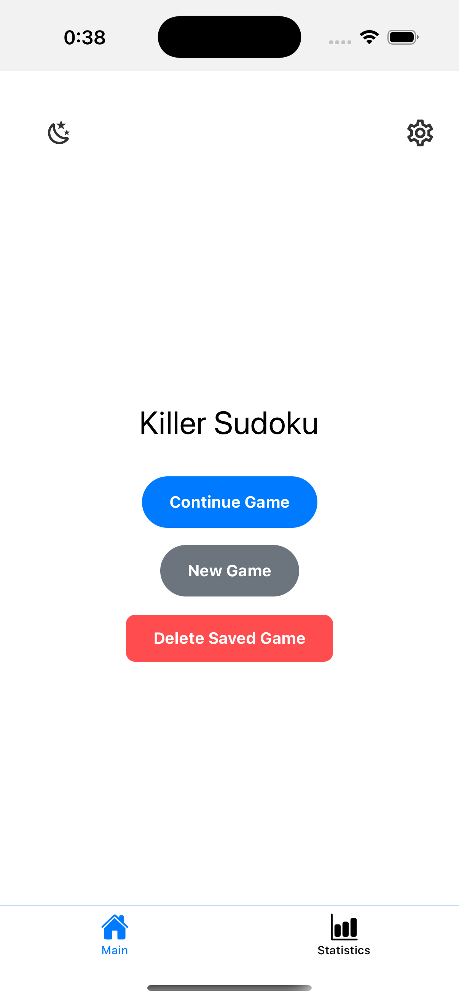
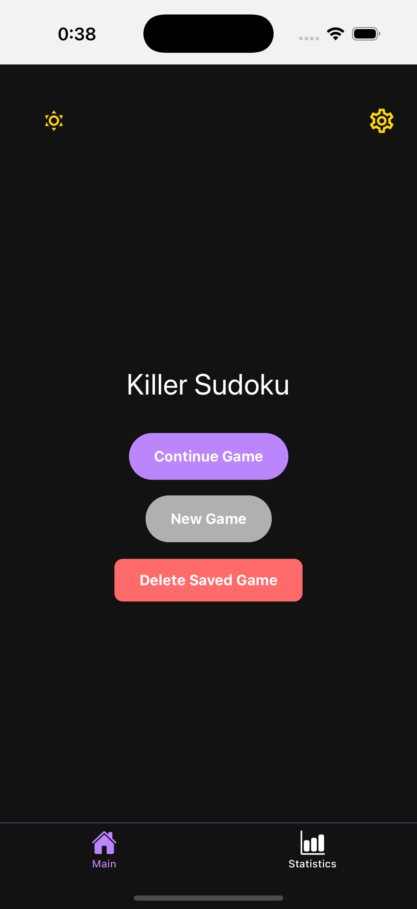
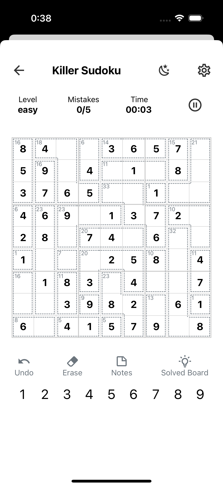
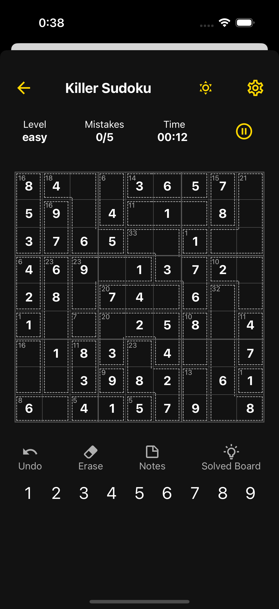
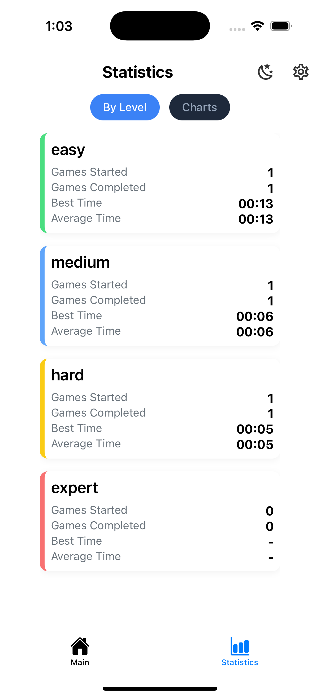
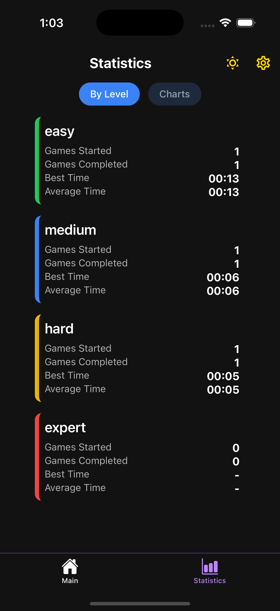
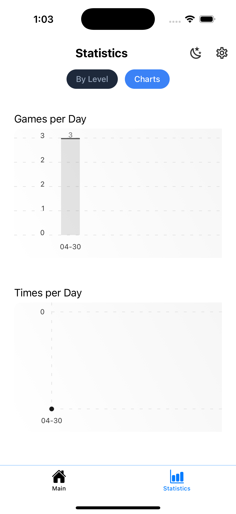
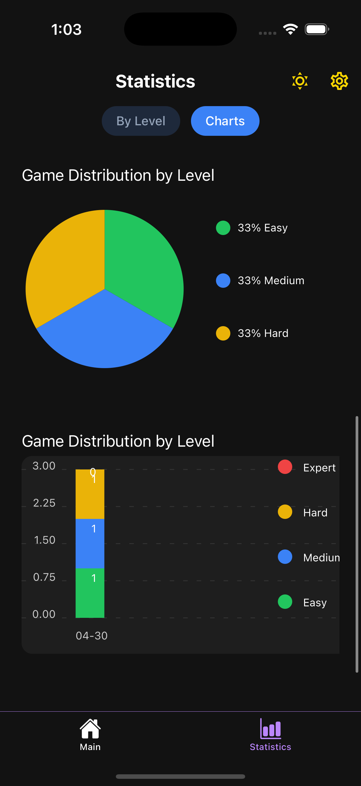

# Killer Sudoku Mobile App

Welcome to **Killer Sudoku**, a modern and highly-optimized Sudoku Killer game built with **React Native**.


Screen | Light | Dark
---------|---------|----------
Main |  | 
Board |  | 
Level Stats |  | 
Charts Stats |  | 

---

## 🎯 Features

- ✅ Generate random Killer Sudoku puzzles across 4 difficulty levels: Easy, Medium, Hard, Expert
- ✅ Killer Sudoku board rendering with dynamic cages and sum labels
- ✅ Notes Mode (pencil in possible numbers)
- ✅ Undo, Erase, Hint system
- ✅ Mistake tracking and limit with popup alert after too many mistakes
- ✅ Game timer (pause/resume supported)
- ✅ Local save & resume for interrupted games
- ✅ Battery optimization (auto-pause timer when app backgrounded)
- ✅ Dark Mode / Light Mode switch (auto detects system theme)
- ✅ Statistics tracking per difficulty level:
  - Games started
  - Games completed
  - Best time
  - Average time
  - Games per Day
  - Times per Day
  - Game Distribution by Level (PieChart, StackedBarChart)
- ✅ Multi-language support: English, Vietnamese, and Japanese

---

## 🚀 Tech Stack

- **React Native** (bare workflow)
- **TypeScript**
- **React Native SVG + react-native-svg** (for cages rendering)
- **MMKV** (for persistent statistics and saves)

---

## 🛠 Installation

```bash
git clone https://github.com/FinbertMDS/SudokuKillerApp.git
cd SudokuKillerApp
npm install
npx pod-install # if iOS
npx react-native run-ios   # or run-android
```

---

## 🛠 Build app

Prepare file for build app
- .env
```text
UNSPLASH_ACCESS_KEY=xxx
```
- android/app/sudoku-key.keystore
```bash
keytool -genkeypair -v -keystore sudoku-key.keystore -alias sudokuKey -keyalg RSA -keysize 2048 -validity 10000
```

```bash
git clone https://github.com/FinbertMDS/SudokuKillerApp.git
cd SudokuKillerApp
cd android
./gradlew assembleRelease
```

---

## 📈 Planned Features (Coming Soon)

- Online Multiplayer mode (Challenge your friends!)
- Daily Killer Sudoku Challenge
- Cloud Syncing (Login + Save Progress)
- Animated Cage Drawing
- Sound effects for move feedback

---

## 📚 Credits

- Sudoku generation inspired by killer-sudoku-generator
- Built with love ❤️ and a passion for math puzzles!

---

## 📜 License

This project is licensed under the MIT License.

---

> Built for puzzle lovers, by puzzle lovers. Happy solving! 🔥🧠
